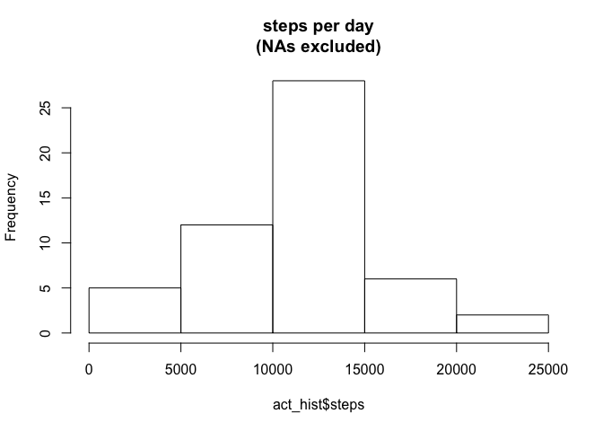
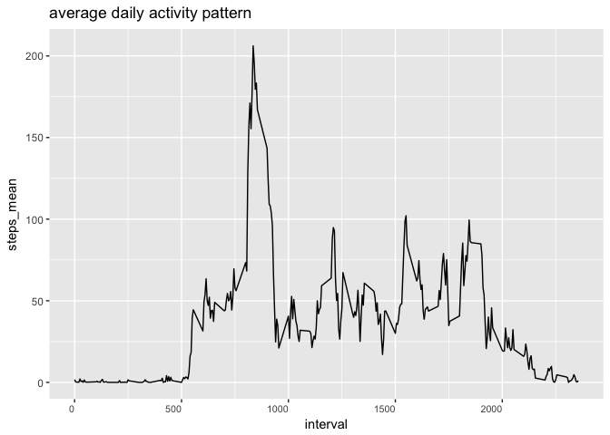
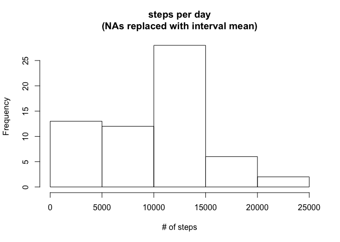
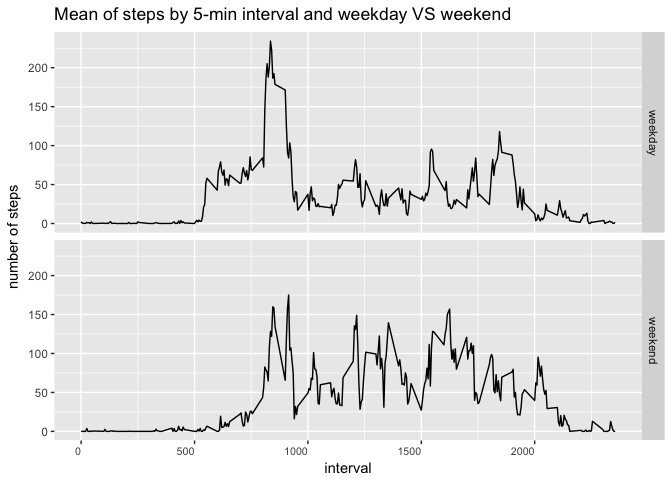

Reproducible Research: Peer Assessment 1
================
Michael Ebner
12/7/2017

Loading and preprocessing the data
----------------------------------

. load the packages . set the working directory . get and clean the data (delte NAs) . the result is one raw data frame containing all the data and one data frame without NAs

Histogram
---------

For the histogram I simpley use the hist() function of the standard plot package.

``` r
act_hist <- act[,c(1,2)]
act_hist <- act_hist %>% group_by(date) %>% summarise_all(funs(sum)) %>% arrange(as.Date(date))
hist(act_hist$steps,main = 'steps per day\n(NAs excluded)',xlab = '# of steps')
```



What is mean total number of steps taken per day?
-------------------------------------------------

Easy to get by using the mean() and median() functions.

``` r
print(round(mean(act_hist$steps)))
```

    ## [1] 10766

``` r
print(round(median(act_hist$steps)))
```

    ## [1] 10765

What is the average daily activity pattern?
-------------------------------------------

First I use a dplyr chain to get a data frame aggregated by interval and the mean of steps per each interval. Then I plot the data using geom\_line() from the ggplot2 pachage.

``` r
act_int <- act[,c(3,1)]
act_int <- aggregate(steps~interval, data = act_int, FUN = mean) %>% arrange(interval)
act_int$interval = as.numeric(act_int$interval)
act_int <- act_int %>% arrange(interval)
names(act_int) <- c("interval","steps_mean")

ggplot(act_int,aes(x=interval,y=steps_mean,group=1))+
     geom_line()+
     theme(axis.text.x = element_text(hjust = 1,size=8))+
     ggtitle('average daily activity pattern')
```



The 5-minute interval that, on average, contains the maximum number of steps
----------------------------------------------------------------------------

The which.max() function comes in handy here.

``` r
act_int$interval[which.max(act_int$steps_mean)]
```

    ## [1] 835

Imputing missing values
-----------------------

Once again I use a dplyr chain to group the data set by interval, then I use mutate and a ifelse statement to exchange missing values with the actual mean of steps for each interval.

``` r
act_complete <- act_raw %>% group_by(interval) %>% mutate(steps=ifelse(is.na(steps),median(steps,na.rm=TRUE),steps))
```

### histogram

``` r
act_hist_comp <- act_complete[,c(1,2)]
act_hist_comp <- act_hist_comp %>% group_by(date) %>% summarise_all(funs(sum)) %>% arrange(as.Date(date))
hist(act_hist_comp$steps,main = 'steps per day\n(NAs replaced with interval mean)',xlab = '# of steps')
```



Are there differences in activity patterns between weekdays and weekends?
-------------------------------------------------------------------------

Here I proceed pretty much the same way as for the graphs above. First I generete a new column giving me the weekdays by using the weekdays() function. Using the new column I can create another column via an ifelse statement that distinguishes between weekdays and weekend. Finally I create a plot with the ggplot2 package. In order to get panels I use the facet\_grid() function of the packge.

``` r
act$dayoftheweek <- factor(weekdays(act$date))
act$daytype= ifelse(act$dayoftheweek %in% c("Sunday","Saturday"),"weekend","weekday")

act_weekend <- act[,c(5,3,1)]
act_weekend <- aggregate(act_weekend$steps,list(as.numeric(act_weekend$interval),act_weekend$daytype),FUN="mean")
names(act_weekend) <- c("interval","day_of_week","steps_mean")
act_weekend <- act_weekend %>% arrange(interval)

ggplot(act_weekend,aes(x=interval,y=steps_mean,group=1))+
     geom_line()+
     facet_grid(day_of_week~.)+
     theme(axis.text.x = element_text(hjust = 1,size=8))+
     ggtitle('average daily activity pattern')+
     labs(title = "Mean of steps by 5-min interval and weekday VS weekend",
       x = "interval",
       y = "number of steps")
```


